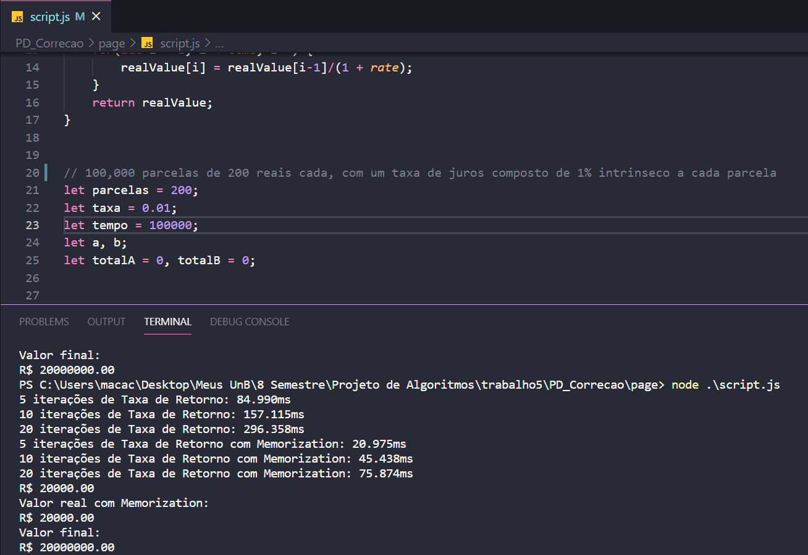
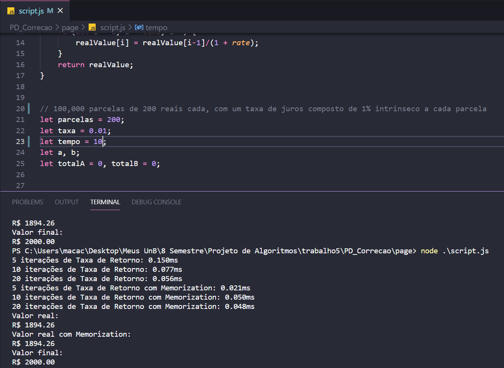

# Minha parcela minha divida

**Número da Lista**: 5<br>
**Conteúdo da Disciplina**: Programação Dinâmica<br>

## Alunos

**Matrícula** | **Aluno** 
:-----------: | :---------:
16/0022673    | Ailamar Alves Guimarães
17/0080307    | Matheus Amaral Moreira

## Sobre 
Nosso projeto organiza uma lista de atividades que devem ser feitas de acordo com o prazo de entrega, devolvendo 
ao usuário a melhor ordem de execução com o mínimo de atrazo possível.

## Screenshots

- Situação de desgaste da memória (100000 iterações)   
<br>



- Situação real do dia a dia (10 prestações de 200 reais cada)
<br>



## Instalação 
**Linguagem**: JavaScript <br>
**Framework**: Node JS <br>

Nosso projeto usa apenas NodeJS como motor.

1. Abra um terminal na pasta que vai ficar os arquivos e faça o clone do repositorio do GitHub para sua máquina:
```
$ git clone https://github.com/projeto-de-algoritmos/PD_JurosParcelados.git
```

2. Segundo passo entrar na pasta do repositório e instalar as dependências do NodeJS (para isso você deve ter o NodeJS instalado):
```
$ cd ./PD_JurosParcelados/page
```

3. Execute o arquivo js com o NodeJs com o comando:
```
$ node script.js
```

## Uso 
Mostra o quanto você realmente gasta do seu dinheiro e o quanto é juros em compras de parcelas fixas com o juros embutido já conhecido.

## Outros 
Espera-se que o avaliador tenha framework Node JS em sua máquina.


